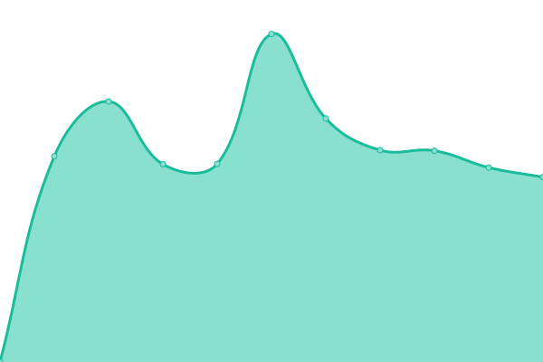
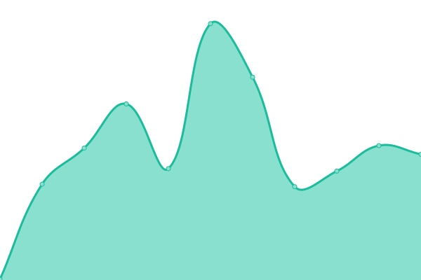

# [📈 Live Status](https://upptime.github.io/upptime): <!--live status--> **🟩 All systems operational**

This repository contains the open-source uptime monitor and status page for [Upptime](https://upptime.js.org), powered by [Upptime](https://github.com/upptime/upptime).

With [Upptime](https://upptime.js.org), you can get your own unlimited and free uptime monitor and status page, powered entirely by a GitHub repository. We use [Issues](https://github.com/upptime/upptime/issues) as incident reports, [Actions](https://github.com/upptime/upptime/actions) as uptime monitors, and [Pages](https://upptime.github.io/upptime) for the status page.

<!--start: status pages-->
<!-- This summary is generated by Upptime (https://github.com/upptime/upptime) -->
<!-- Do not edit this manually, your changes will be overwritten -->
<!-- prettier-ignore -->
| URL | Status | History | Response Time | Uptime |
| --- | ------ | ------- | ------------- | ------ |
| [Devinix](https://www.devinix.se) | 🟩 Up | [devinix.yml](https://github.com/jonasgithub/Upptime/commits/master/history/devinix.yml) | 

 1653ms
     
 | 

   

| [Devinix Cloud](https://dvx.cloud) | 🟩 Up | [devinix-cloud.yml](https://github.com/jonasgithub/Upptime/commits/master/history/devinix-cloud.yml) | 

 1038ms
     
 | 

   

| [Microsoft 365](https://outlook.office.com/owa/) | 🟩 Up | [microsoft-365.yml](https://github.com/jonasgithub/Upptime/commits/master/history/microsoft-365.yml) | 

 219ms
     
 | 

   

| Teknisk Dokumentation | 🟩 Up | [teknisk-dokumentation.yml](https://github.com/jonasgithub/Upptime/commits/master/history/teknisk-dokumentation.yml) | 

 766ms
     
 | 

   

| Arendehantering | 🟩 Up | [arendehantering.yml](https://github.com/jonasgithub/Upptime/commits/master/history/arendehantering.yml) | 

 2302ms
     
 | 

   

<!--end: status pages-->

[**Visit our status website →**](https://upptime.github.io/upptime)

## 📄 License

- Code: [MIT](./LICENSE) © [Upptime](https://upptime.js.org)
- Data in the `./history` directory: [Open Database License](https://opendatacommons.org/licenses/odbl/1-0/)
